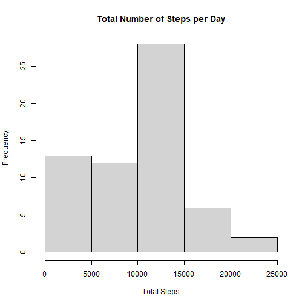
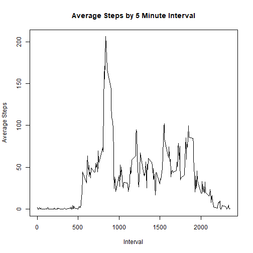
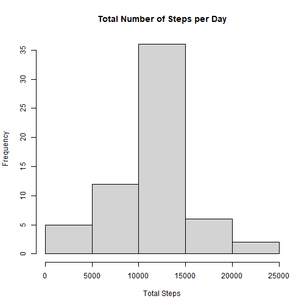
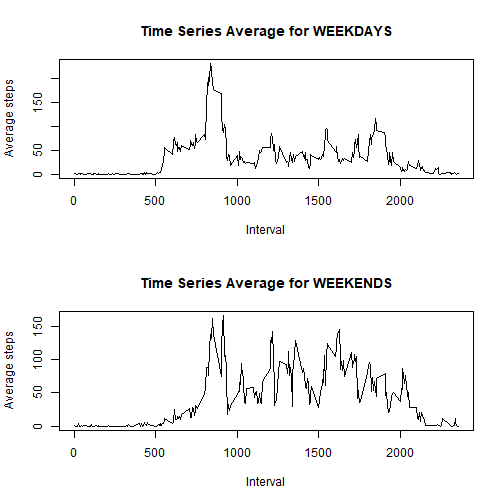

# Loading and preprocessing the data

```r
library(dplyr)
library(lubridate)

Raw_Data <- read.csv("activity.csv")
```

# What is mean total number of steps taken per day?

For this part of the assignment, you can ignore the missing values in the dataset.

## Calculate the total number of steps taken per day

```r
GroupedByDay <- mutate(Raw_Data, date = ymd(date)) %>%
  group_by(date) %>%
  summarize(TotalSteps = sum(steps, na.rm = TRUE)) %>%
  arrange(date)
```

## Make a histogram of the total number of steps taken each day

```r
hist(GroupedByDay$TotalSteps,
     main = "Total Number of Steps per Day",
     xlab = "Total Steps",
     ylab = "Frequency")
```



## Calculate and report the mean and median of the total number of steps taken per day
Mean:

```r
mean(GroupedByDay$TotalSteps)
```

```
## [1] 9354.23
```

median:

```r
median(GroupedByDay$TotalSteps)
```

```
## [1] 10395
```

# What is the average daily activity pattern?

## Make a time series plot of the 5-minute interval (x-axis) and the average number of steps taken, averaged across all days (y-axis)
Prepare data:

```r
GroupedByInterval <- group_by(Raw_Data, interval) %>%
  summarize(AvgSteps = mean(steps, na.rm = TRUE)) %>%
  arrange(interval)
```

Plot:

```r
plot(x = GroupedByInterval$interval,
     y = GroupedByInterval$AvgSteps,
     type = "l",
     main = "Average Steps by 5 Minute Interval",
     xlab = "Interval",
     ylab = "Average Steps")
```



## Which 5-minute interval, on average across all the days in the dataset, contains the maximum number of steps?

```r
GroupedByInterval[GroupedByInterval$AvgSteps == max(GroupedByInterval$AvgSteps),]$interval
```

```
## [1] 835
```

# Imputing missing values
## Calculate and report the total number of missing values in the dataset.

```r
sum(is.na(Raw_Data$steps))
```

```
## [1] 2304
```

## Devise a strategy for filling in all of the missing values in the dataset. 
We will use the mean for the interval.

## Create a new dataset that is equal to the original dataset but with the missing data filled in.

```r
NAsRemoved <- data.frame()
for (i in GroupedByInterval$interval){
  
  tempframeNAs <- filter(Raw_Data, interval == i) %>%
    filter(is.na(steps)) %>%
    mutate(steps = GroupedByInterval[GroupedByInterval$interval == i,]$AvgSteps)

  tempframeNoNas <- filter(Raw_Data, interval == i) %>%
    filter(!is.na(steps))
  
  NAsRemoved <- rbind(NAsRemoved,
                      tempframeNAs,
                      tempframeNoNas)
}
```

## Make a histogram of the total number of steps taken each day and Calculate and report the mean and median total number of steps taken per day.

```r
GroupedByDay2 <- mutate(NAsRemoved, date = ymd(date)) %>%
  group_by(date) %>%
  summarize(TotalSteps = sum(steps, na.rm = TRUE)) %>%
  arrange(date)

hist(GroupedByDay2$TotalSteps,
     main = "Total Number of Steps per Day",
     xlab = "Total Steps",
     ylab = "Frequency")
```



mean:

```r
mean(GroupedByDay2$TotalSteps)
```

```
## [1] 10766.19
```

median:

```r
median(GroupedByDay2$TotalSteps)
```

```
## [1] 10766.19
```

### Do these values differ from the estimates from the first part of the assignment? 
Yes

### What is the impact of imputing missing data on the estimates of the total daily number of steps?
Since most of the missing values were from later in the day, it raised the average total number of steps by "including" that data.

#Are there differences in activity patterns between weekdays and weekends?
##Create a new factor variable in the dataset with two levels – “weekday” and “weekend” indicating whether a given date is a weekday or weekend day.

```r
Weekender <- mutate(NAsRemoved, DoW = weekdays(ymd(date))) %>%
  mutate(WeekendBoolean = (DoW %in% c("Saturday","Sunday"))) %>%
  mutate(WeekendBoolean = as.factor(WeekendBoolean))

levels(Weekender$WeekendBoolean) <- c("Weekday", "Weekend")
```

## Make a panel plot containing a time series plot  of the 5-minute interval (x-axis) and the average number of steps taken, averaged across all weekday days or weekend days (y-axis).

```r
PlotByDay <- group_by(Weekender, WeekendBoolean, interval) %>%
  summarize(AvgSteps = mean(steps))
```

```
## `summarise()` has grouped output by 'WeekendBoolean'. You can override using the `.groups`
## argument.
```

```r
par(mfcol = c(2,1))
with(PlotByDay[PlotByDay$WeekendBoolean == "Weekday",], 
     plot(x = interval,
          y = AvgSteps,
          type = "l",
          main = "Time Series Average for WEEKDAYS",
          xlab = "Interval",
          ylab = "Average steps"))

with(PlotByDay[PlotByDay$WeekendBoolean == "Weekend",], 
     plot(x = interval,
          y = AvgSteps,
          type = "l",
          main = "Time Series Average for WEEKENDS",
          xlab = "Interval",
          ylab = "Average steps"))
```


